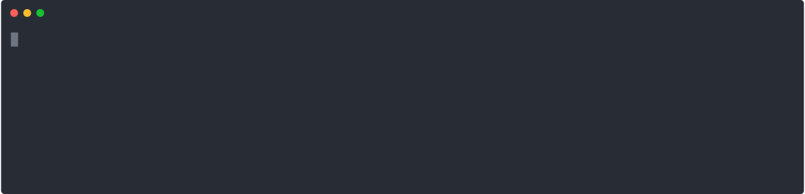

# Homelab


---

## FAQ

### How do I run my services?

I run them as Docker containers using `docker-compose`

### How do I connect to my homelab?

I use Tailscale is used for SSH & RDP connectivity

### How do I expose my services to the internet?

Cloudflare Tunnels behind an nginx reverse-proxy is used to expose services through subdomains

## Environment Setup

To setup the environment run the following commands

```bash
bash preinstall.sh
```



Followed by

```
zsh run.sh
```


## Update Services

```bash
bash update.sh
```


## Video Guide

Run a homelab server using Cloudflared Tunnel and Nginx Proxy Manager

[](https://www.youtube.com/watch?v=Udc6HeOqxCY&ab_channel=AbhinavKM)

## TODO:

* Dedicated wiki page
* Integrate dotfiles and zshrc
* CI/CD
* Bash script to automate setup
* Rust server https://github.com/samrocketman/docker-compose-lgsm-rust-dedicated-server/blob/main/docker-compose.yml
